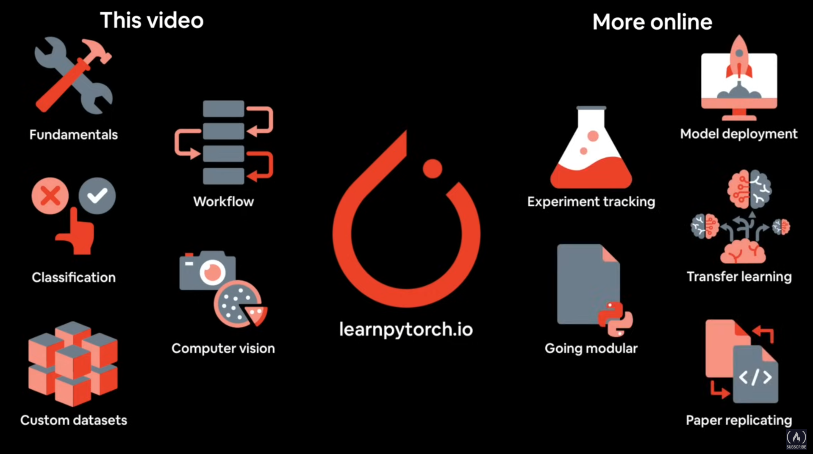
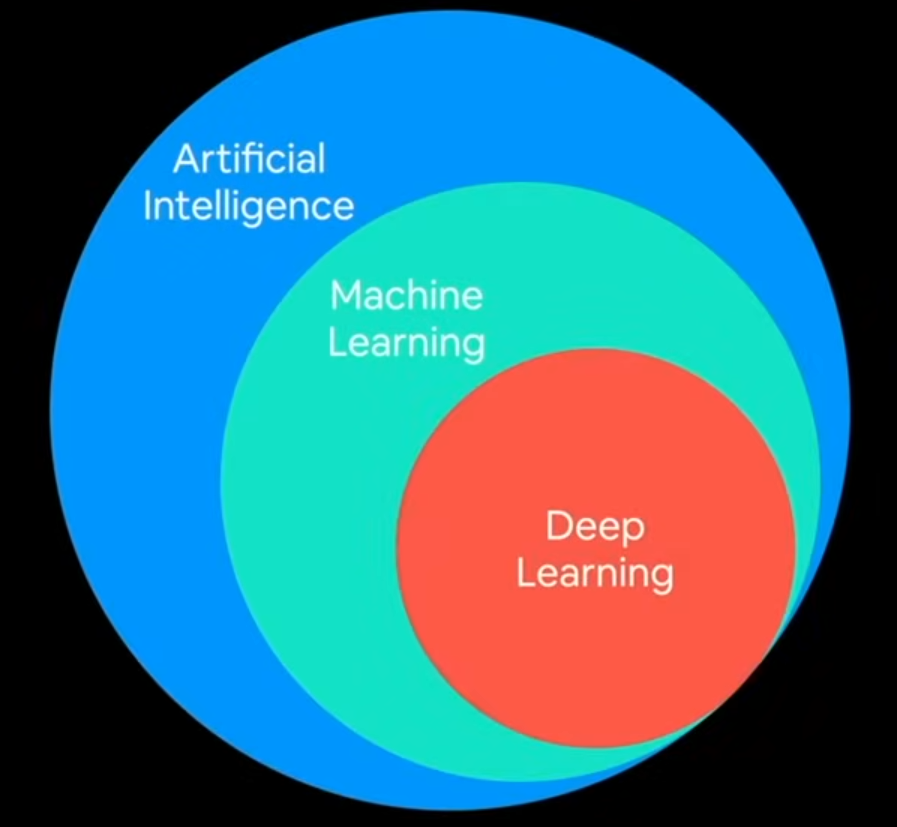
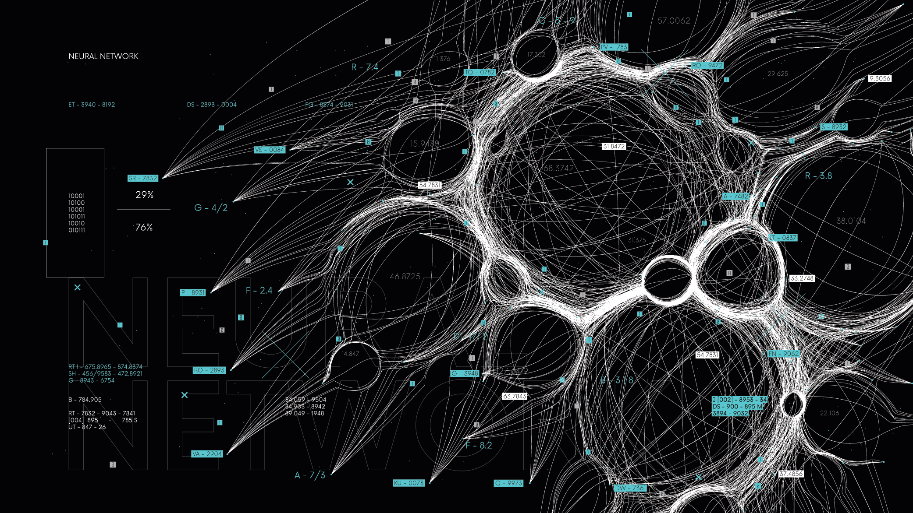
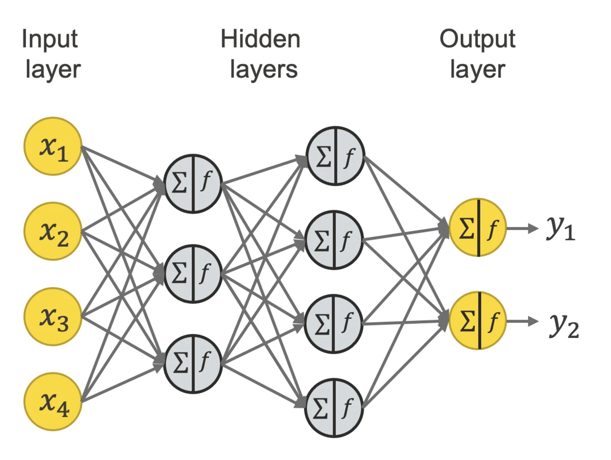
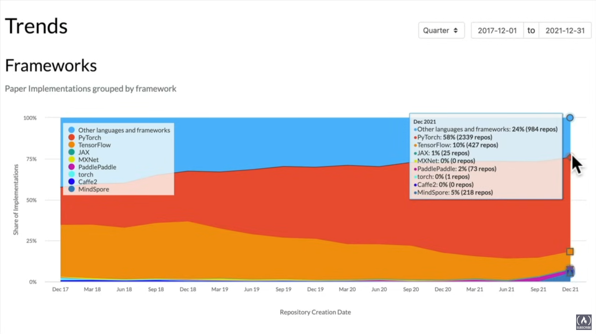

https://learnpytorch.io/

### Chapter 0

## PyTorch and Deep Learning Fundamentals

---

# What is Deep Learning

- Machine learning is turning data into numbers and finding patterns in those numbers  
- Finding those patterns is what Machine Learning is for!

---

# Machine Learning vs Deep Learning

- Deep Learning ⊆ Machine Learning ⊆ AI  
- Deep Learning is a bit nuanced compared to Machine Learning

Source: [Simplilearn - AI vs ML vs DL](https://www.simplilearn.com/tutorials/artificial-intelligence-tutorial/ai-vs-machine-learning-vs-deep-learning#:~:text=Artificial%20Intelligence%20is%20the%20concept,algorithms%20to%20train%20a%20model.)

---

## Traditional Programming vs Machine Learning Algorithms

### Traditional Programming

- Starts with inputs → Rules/Algorithm → Output

---

# Deep Learning: A Deeper Dive into Machine Learning

## What is Deep Learning?

Deep learning is a subset of machine learning that focuses on neural networks with multiple layers ("deep" networks) to analyze data and extract intricate patterns. Think of it as a more sophisticated approach to the core idea of machine learning, which is turning data into numbers and finding patterns in those numbers.

---

## Machine Learning vs. Deep Learning

The relationship between artificial intelligence (AI), machine learning (ML), and deep learning (DL) is a hierarchical one:  
**DL ⊆ ML ⊆ AI**

While ML is a broad field of algorithms that allow computers to learn from data without being explicitly programmed, DL takes this a step further. It uses deep neural networks to learn from vast amounts of data, often outperforming traditional ML algorithms on complex tasks like image recognition and natural language processing.

The nuance is that deep learning models can automatically learn and extract features from raw data, whereas many traditional machine learning models require manual feature engineering.

### Structured Data (Mostly Machine Learning)

You want to use Machine Learning mostly on structured data, used mainly on production

### Algorithms

- Random Forest
- Gradient Boosted Models
- Naive Bayes
- Nearest Neighbour
- Support Vector Machine etc...

These are refered to as shallow algorithms

### Unstructured Data (Mostly Deep Learning)

You want to use Deep Learning in unstructured data

### Algorithms

- Neural Networks
- Fully connected Neural Networks
- Convolutional Neural Network
- Recurrent Neural Network
- Tranformer etc...

#### (Depending on your problemset many algorithms can be used for both)

---

## Traditional Programming vs. Machine Learning Algorithms

### Traditional Programming

In traditional programming, you explicitly define the rules or algorithms that transform your input data into the desired output. It's a clear, linear process:

**Input → Rules/Algorithm → Output**

### Machine Learning Algorithms

Machine learning flips this paradigm. Instead of providing the rules, you provide both the input data and the corresponding output. The algorithm then learns the rules that map the inputs to the outputs. This approach is fundamental to **supervised learning**, where the model is trained on a labeled dataset.

---

## Supervised Learning

In supervised learning, a model learns to predict an output based on a set of labeled input data. The "supervision" comes from the fact that the algorithm is guided by the correct answers (the labels) during training. This is like a student learning with the help of a teacher who provides both the problem and the solution.

---

## Unsupervised Learning

In contrast, unsupervised learning deals with unlabeled data. The goal here isn't to predict a specific output but to find hidden patterns or structures within the data. It's like a student exploring a new topic on their own, trying to find connections without any prior guidance.

---

## Semi-supervised Learning

Semi-supervised learning combines aspects of both supervised and unsupervised learning. It uses a small amount of labeled data along with a large amount of unlabeled data to train a model. This is particularly useful when obtaining labeled data is expensive or time-consuming.

---

## Reinforcement Learning

Reinforcement learning is a different paradigm where an agent learns to make decisions by interacting with an environment. The agent receives rewards for good actions and penalties for bad ones, and its goal is to maximize the cumulative reward over time.

Think of it as training a dog with treats—the dog learns which behaviors are rewarded.

---

## Transfer Learning

Transfer learning is a paradigm of deep learning, its taking the patterns of one of the models that has learned of a dataset and tranferring it to another model.

The blind leading the blind...

--

## The Power of Deep Learning

Deep learning's strength lies in its ability to handle complex, high-dimensional data, such as images, audio, and text. The deep layers of the neural network can automatically learn hierarchical features.

For example, in an image recognition task:

- The first layer might detect edges and curves,
- A subsequent layer might combine these to detect shapes like circles and squares,
- A final layer might use these shapes to identify complex objects like faces.

This capability eliminates the need for manual feature engineering, making deep learning incredibly powerful for a wide range of applications.

## What is deep learning good for?

- Problems with long lists of rules - when the traditional approach failes, machine learning/deep learning may help
- Continually changing environments - deep learning can adapt (learn) to new scenarios
- Discovering insights within large collections of data - can you imagine trying to hand-craft rules for what 101 different kinds of food look like

### Use cases

#### Sequence to Sequence

- YouTube recommendation
- Translation
- Speech recognition

#### Classification/ Regression

- Computer vision
- Language Language Processing

## What deep learning is not good for?

- When you need explainability - the patterns learned by a deep learning model are typically uninterpretable by a human
- When the traditional approach is a better option - if you can accomplish what you need with a simple rule-based system
- When errors are unacceptable - since the outputs of deep learning are also probability based, they arent always predictable
- When you dont have much data - deep learning models usually require a fairly large amount of data to producte great results

## What are Neural Networks?

https://aws.amazon.com/what-is/neural-network/#:~:text=A%20neural%20network%20is%20a,that%20resembles%20the%20human%20brain.

A neural network is a method in artificial intelligence (AI) that teaches computers to process data in a way that is inspired by the human brain. It is a type of machine learning (ML) process, called deep learning, that uses interconnected nodes or neurons in a layered structure that resembles the human brain.

Inputs (Data) -> Numerical Encoding -> Neural Network -> Representation Outputs -> Outputs

This represents our learning representation based on the inputs (data) detecting patterns/features/weights

Input Layer -> Pattern Recognition -> Output Layer

# What is PyTorch?

https://pytorch.org/

Writes fast deep learning code in Python, able to access many pre-built deep learning models (Torch Hub/torchvision.models)
As a stack: Preprocess data, model data, deploy model in your application/cloud. Originally designed and used in-housed by Facebook/Meta (now open-source and used by copanies such as Tesla, Microsoft, OpenAI)

## Why PyTorch?

Many companies and users use PyTorch to create and configure repos using PyTorch, it values preceeding aswell as startups convert to PyTorch (Tesla using PyTorch for image processing, OpenAI use PyTorch as a standard, PyTorch is used for agriculture aswell, Meta/Facebook use PyTorch, Microsoft, etc..)

## What is a GPU/TPU

- GPU - Graphics Processing Unit
- TPU - Tensor Processing Unit

### What is CUDA and How Does it Work?

IncredibuildCUDA (Compute Unified Device Architecture) is a parallel computing platform and programming model developed by NVIDIA that allows developers to use the processing power of NVIDIA Graphics Processing Units (GPUs) for general-purpose computing tasks

# Tensor

- What is a Tensor?

A mathematical object analogous to but more general than a vector, represented by an array of components that are functions of the coordinates of a space.

https://en.wikipedia.org/wiki/Tensor
