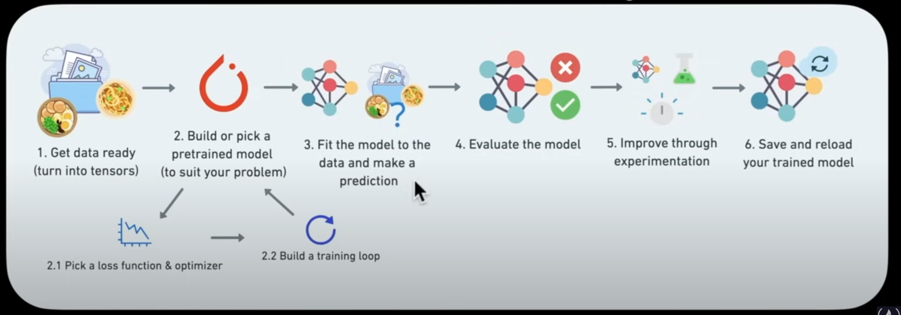

# How we are going to approach this:

- PyTorch Fundamentals
-  - Dealing with Tensore and Tensor operations
- Preprocessing data
- Building and using pretrained deep learning models
- Fitting a model to the data (Learning patterns)
- Making predictions with a model (using patterns)
- Evaluating models
- Saving and loading models
- Using a trained model to make predictions on custom data

